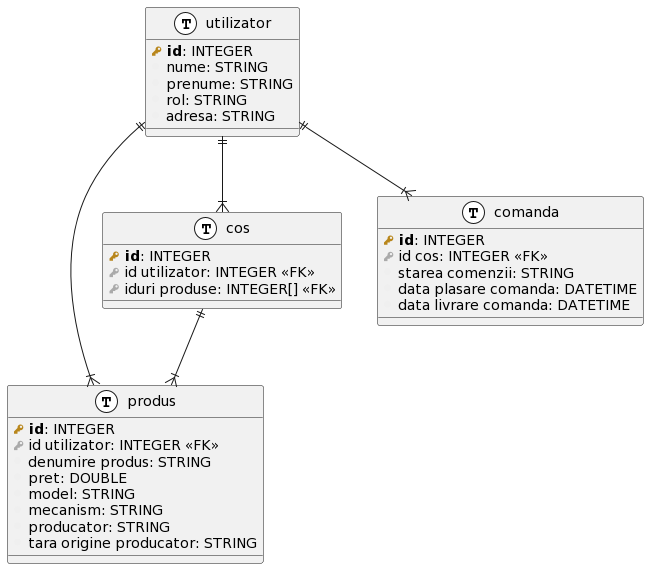

# Proiect PS:
## WatchMarket - Un magazin online pentru comercializarea ceasurilor

##### Dragomir Dan-Antonio 30237
#
### Descrierea functionalitatilor:

Acest proiect este o aplicatie web de tip e-shop care se specializeaza in comercializarea ceasurilor.

Functionalitatile prezente in aceasta aplicatie vor fi bazate pe rolurile utilizatorilor acesteia, ceea ce implica si o functionalitate de logare.

Functionalitatile sunt de creare, editare, vizualizare si stergere a produselor, de cos de cumparaturi, de comandare a produselor din cos si de filtrare a produselor.

##### Tipurile de utilizatori sunt:
- Cumparator (user obisnuit)
- Vanzator (cu permisiuni de creare, editare si de stergere a produselor proprii)
- Administrator (permisiuni pentru orice actiune)
#
### Baza de date:
Baza de date prezinta urmatoarele tabele:
- tabela utilizatori - id, nume, prenume, rol, adresa
- tabela produse - id, denumire produs, pret, model, mecanism, producator,
  tara origine producator, id utilizator (vanzator)
- tabela cos - id, id utilizator, id produs
- tabela comanda - id, id cos, starea comenzii, data plasare comanda, data livrare comanda

### Clasele:

Conform bazei de date au fost create clase cu campurile date mai sus, si o interfata si o clasa de tip Observer pentru a sterge cosul si produsele care au fost comandate la creearea unei comenzi.

De asemenea alte clase create sunt clasele de tip repository, de populare a bazei de date, de controller si de tratare a exceptiei de lipsa a obiectului din baza de date.